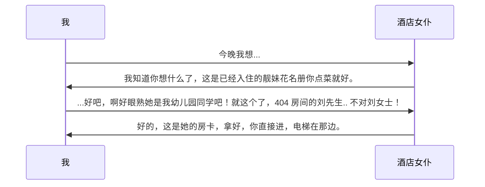
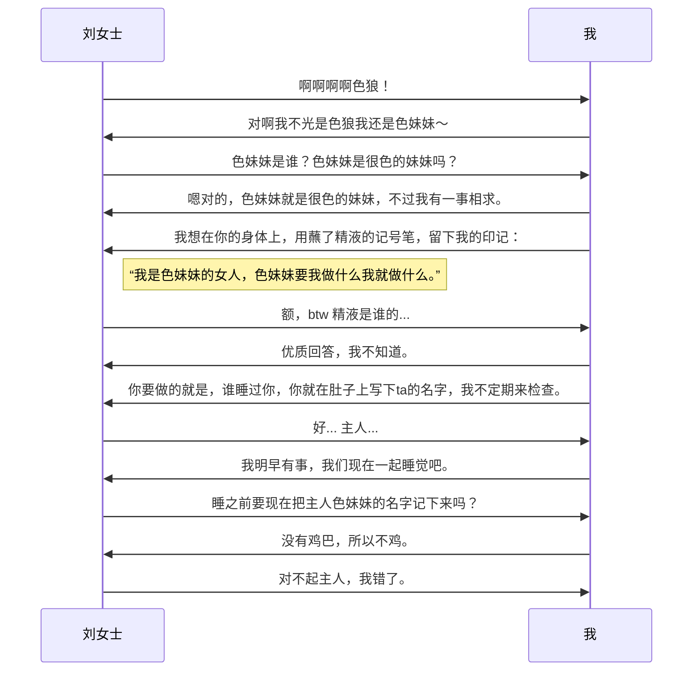

+++
date = '2026-10-02T00:27:56+08:00'
title = '关于本站的评论系统'
description = '有些梦想不过是一种奢望。'
categories = ["文学", "网络技术"]
tags = ["文学", "Website"]
# comment_id = "40dca0ee6b7045894e36d8b3b67d6350"
draft = true
+++

我是一直忘了给本站加评论区的，就像这篇 post 的 `comment_id` 是被注释掉的。

但是有另一个很现实的问题就是评论放在哪里，那肯定有人会说诶你都把博客代码放 `sb-child/sb-child` 了那你在 GitHub 开个 discussions 或者 issues 问题不就解决了吗？

对确实问题解决了，但是我一拍脑门我首先想到的就是我的架空项目，我想为此构建一套可能是最过度设计的集群来解决问题。

自从我离家出走，我就逐渐对变态网络，星球导航系统，巧克力这类东西感兴趣。它们最坏不过需要一位光着身子的酒店女仆，和一只甘愿以身相许的妓女，你就可以睡天下所有人对把。

比如我离家出走了，没有房子没有车没有几把没有蛋没有子宫没有小穴没有比特币，但是我认识一位酒店女仆，我可以直接去找她：

ok我顺利拿到了房卡，我什么都不需要有，也不需要谁认识我，我只要认识一两个人就够了。在电梯间我脑海里全是色情。

出了电梯，我对着指示牌做二分法搜索终于滴的一声我冲进了门：

这样，我成功建立了根据地，以后我不是形单影只了，有一只人类会甘愿为我传递情报。人人睡我，我睡人人，这就是我梦想中的网络。

不过，我的梦想只是奢望。每一个我睡过的女人都会收我小费，妓女会得病死掉，抑郁上吊自杀，跑路移民海外，跟我分手，背叛我，或者像我那样离家出走成为下一个我。每一个给我点菜的前台，可能把先生叫成女士，反之亦然，因此可能漏掉那么不到百分之一的跨性别者，可能以为每个住客都是女同性恋，可能住客们悄悄调换了房间导致我遇到麻烦。

我不过是无家可归的旅行者，没有目的地，没有出发点，没有帐篷，没有信标。有人批评我说这样的网络根本不可能实现，这种东西太复杂，太费力，太低效。我感觉我过着原始人那样的生活。

## 1. 梦中楼阁

如果我先不打地基，我直接盖二楼呢？脑内的天然毒品会麻醉下我的思维，当我大展宏图的时候我感到自信，性福，与性快感。因为我拿着一支笔，笔可以是一种性玩具，在纸上书写时我实际上是在让纸高潮。

第一步，让我细数下我的设备：

1. 老朋友送的谷歌 Pixel 3，但是那个朋友是我的前对象之一，电池寿命不太够，屏幕有点烧。
2. 朋友送的小米 11 Lite，但是那个朋友是我的前对象之一，我的**备用机**，屏幕有点烧。
3. 被摔弯然后返厂修好的魅族 22，我的**主力机**，因为原主人摔了我的电脑，电池没死死于挖矿但是后盖开胶了。
4. 之前的旗舰机 OPPO K5，但是电池死于挖矿。
5. 之前自己买的 LG G8，但是电池死于挖矿。
6. 拍卖网站买的联想小新笔记本，2020年的东西，但是电池死于挖矿。

第二步，哪些设备还能开机：

1. 可以。能不能持续开机看充电器给不给力。
2. 可以。
3. 可以。
4. ~~不行。电池拆掉扔垃圾桶了。~~
5. ~~不行。电池拆掉扔垃圾桶了。~~
6. 可以。能不能持续开机看我的 `battery-care` 脚本，有时开着它是在纯粹的消耗电池寿命，但不开可能会很快没电关机，第二天EC会因为没有正确reset导致屏幕变暗。

第三步，哪些设备有公网IP：

**都没有。** 退而求其次，哪些设备能上网？这个问题比较复杂：

1. 连接 wifi，开个代理软件(占了安卓VPN)。
2. 连接 wifi，开个代理软件(占了安卓VPN)。
3. 连接 wifi 或移动网络，开个代理软件(占了安卓VPN)。
4. ~~不存在。~~
5. ~~不存在。~~
6. 连接 wifi，电脑通过手机 1 或 3 的代理上网，如果其中一个死了会故障转移。

第四步，哪些设备会移动：

1. 几乎与电脑形影不离。
2. 每天都在移动。
3. 每天都在移动。
4. ~~吃灰。~~
5. ~~吃灰。~~
6. 只有键盘鼠标会移动。

ok那评估完这些垃圾，可得：

| 设备            | 可用性                                        |
| --------------- | --------------------------------------------- |
| 1. 谷歌 Pixel 3 | 最高(甚至能保证供电,只需要静静躺着)           |
| 2. 小米 11 Lite | 比较低(随时带着,有时离线)                     |
| 3. 魅族 22      | 中等(随时带着,有移动网络)                     |
| 6. 联想小新     | 比较高(更新内核重启downtime,网络调试downtime) |

但是可用性只是宏观上的百分比。如果家里停电了，能上网的设备只剩魅族 22，可用性再高有什么用？

两台手机我都拿在身上，如果上面跑的服务持续耗电，等两台手机都在外面挂了，我只能徒步几公里找到回家的路，移动网络再稳有什么用？

### 1.1. 垃圾站上的集群

没有一个设备是保证100%在线的，这个时候就需要一种地基... 因为没有地基怎么盖楼？椅子四条腿总得有一条存在，才不会变成浮空车。

我知道很多地基：

| 地基                    | 能用吗                                        |
| ----------------------- | --------------------------------------------- |
| tailscale               | 不能。3台手机都跑着代理了，没法再跑一个vpn    |
| zerotier                | 不能。3台手机都跑着代理了，没法再跑一个vpn    |
| cloudflared             | 有时候能。前提是客户端要能稳定连接 Cloudflare |
| headscale,frp,netbird等 | 不能。我至少需要买一个vps                     |

没有这些地基，我就享受不到 VPN 带来的技术红利，享受不到前人搭建的虚拟交换机。

但是造这个地基很难。没有它我就没法让这4台设备互相建立连接，也没法让浏览器端能找到通往其中一台设备的路。

我缺的工程材料，是前文那个酒店女仆，我还很想她，和跟我睡的刘先生.. 不不，刘女士。

浏览器端因为什么都不知道，我能做的只是给浏览器留一张黄色小卡片，上面写着酒店地址和女仆的性别。浏览器自己去找女仆点技师就可以。

等等，女仆... 浏览器要找女仆，首先女仆要存在，要脱光衣服给全世界人看，要对全世界的色狼开放，那么浏览器才能有机会联系上她。但是我要怎么创建这个女仆？我不能用`/summon`指令因为这是地球Online。

既然我不能创建，那我可以利用吗？世界上应该有很多慈善家，比如 [pastebin](https://pastebin.com/)，[onlinenotebook](https://onlinenotebook.net/)，[nostr](https://nostr.com/info) 和一些我不知道的东西。它们有个特点就是，可以帮我**暂存一份靓妹花名册**。

然后就是另一个严峻的问题，刘女士... 的房间，我要怎么进。我甚至找不到电梯间，找不到走廊，没法二分查找。

刘女士是个注重隐私的人，她会轮换sim卡，轮换一次性手机，rotate gpg key，注册多个微信小号... 要不是有个前台女仆，连国安都没法对她下手。

还好女仆会记下她当时正在用的联系方式。浏览器可以向女仆问到刘女士的[以太坊](http://ethereum.org/)地址，给它打 0.001 eth 意思是想操她，打 0.0011 eth 意思是想跟她约饭，甚至可以把 ascii 编码进 amount 里传递文本信息，还能在智能合约里写情书发给她。为了省钱我其实应该打 [Nano](https://nano.org/) 的。

但是这个不是太低效，是巨他妈低效。我想了想算了，我直接加她现在的微信，给她打视频电话。

微信电话... 并不是简单的事情，它通过互联网联通了我与我的主人刘女士，这是继电话线时代的第二次革新。我向她逐字朗读gpg加密消息，她用她当前的密钥解密，很不巧我读错了一个字，让她很苦恼。唉有事还是打字说把。

微信就是一个不错的，可以联通我们的渠道，但是缺点很明显，浏览器没法用微信。我要找个浏览器可以用的方式，让浏览器可以主动跟刘女士建立联系。

---

(draft, wip)
