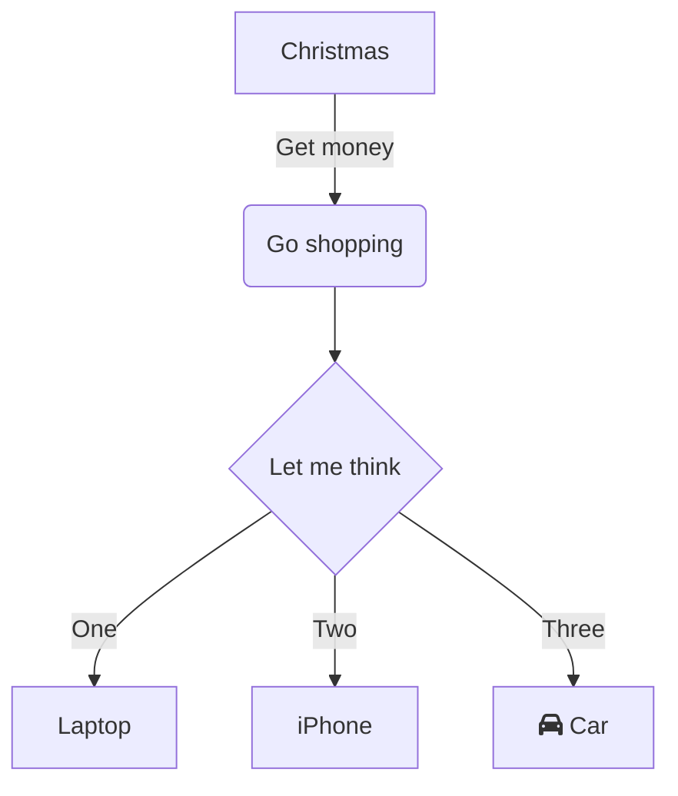
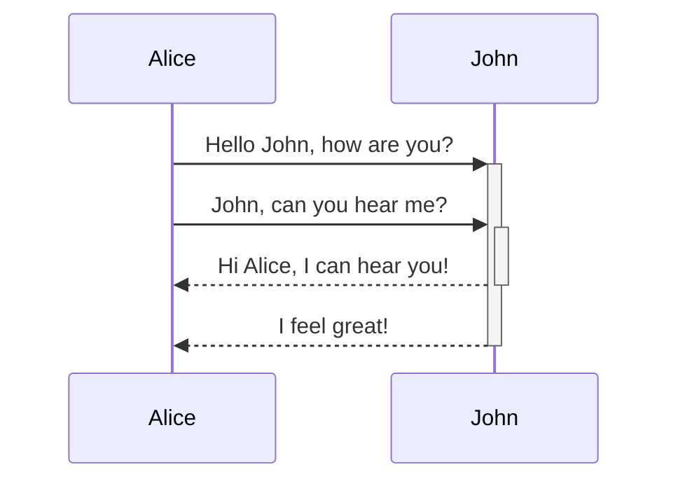
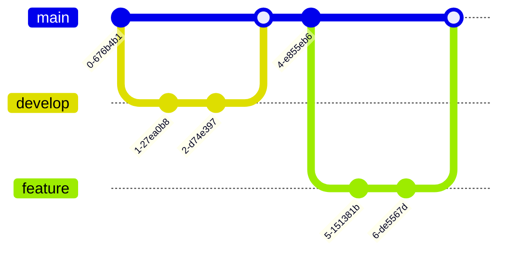

+++
date = '2026-05-30T13:08:41+08:00'
draft = false
title = 'Test Page'
description = "测试页面"
+++

## mermaid test

FIXME: 切换主题需要刷新页面

flowchart TD



sequenceDiagram



git



## echarts test

test code

```echarts {height="350px"}
{
    title: {
        text: 'ECharts 入门示例'
    },
    tooltip: {},
    legend: {
        data: ['销量']
    },
    xAxis: {
        data: ['衬衫', '羊毛衫', '雪纺衫', '裤子', '高跟鞋', '袜子']
    },
    yAxis: {},
    series: [
        {
        name: '销量',
        type: 'bar',
        data: [5, 20, 36, 10, 10, 20]
        }
    ]
}
```

test src

```echarts {height="500px",src="chart/test-chart-1.json"}

```

test src+code

```echarts {height="500px",src="chart/test-chart-2.json"}
{
    "title": { "text": "默认折线图标题" },
    "color": [
        "#5070dd",
        "#b6d634",
        "#505372"
    ],
    "tooltip": {
        "trigger": "axis",
        "axisPointer": {
            "type": "cross"
        }
    },
    "grid": {
        "right": "20%"
    },
    "toolbox": {
        "feature": {
            "dataView": {
                "show": true,
                "readOnly": false
            },
            "restore": {
                "show": true
            },
            "saveAsImage": {
                "show": true
            }
        }
    },
    "legend": {
        "data": [
            "Evaporation",
            "Precipitation",
            "Temperature"
        ]
    },
    "xAxis": [
        {
            "type": "category",
            "axisTick": {
                "alignWithLabel": true
            },
            "data": [
                "Jan",
                "Feb",
                "Mar",
                "Apr",
                "May",
                "Jun",
                "Jul",
                "Aug",
                "Sep",
                "Oct",
                "Nov",
                "Dec"
            ]
        }
    ],
    "yAxis": [
        {
            "type": "value",
            "name": "Evaporation",
            "position": "right",
            "alignTicks": true,
            "axisLine": {
                "show": true,
                "lineStyle": {
                    "color": "#5070dd"
                }
            },
            "axisLabel": {
                "formatter": "{value} ml"
            }
        },
        {
            "type": "value",
            "name": "Precipitation",
            "position": "right",
            "alignTicks": true,
            "offset": 80,
            "axisLine": {
                "show": true,
                "lineStyle": {
                    "color": "#b6d634"
                }
            },
            "axisLabel": {
                "formatter": "{value} ml"
            }
        },
        {
            "type": "value",
            "name": "温度",
            "position": "left",
            "alignTicks": true,
            "axisLine": {
                "show": true,
                "lineStyle": {
                    "color": "#505372"
                }
            },
            "axisLabel": {
                "formatter": "{value} °C"
            }
        }
    ],
    "series": [{ "type": "line", "smooth": true }]
}
```
